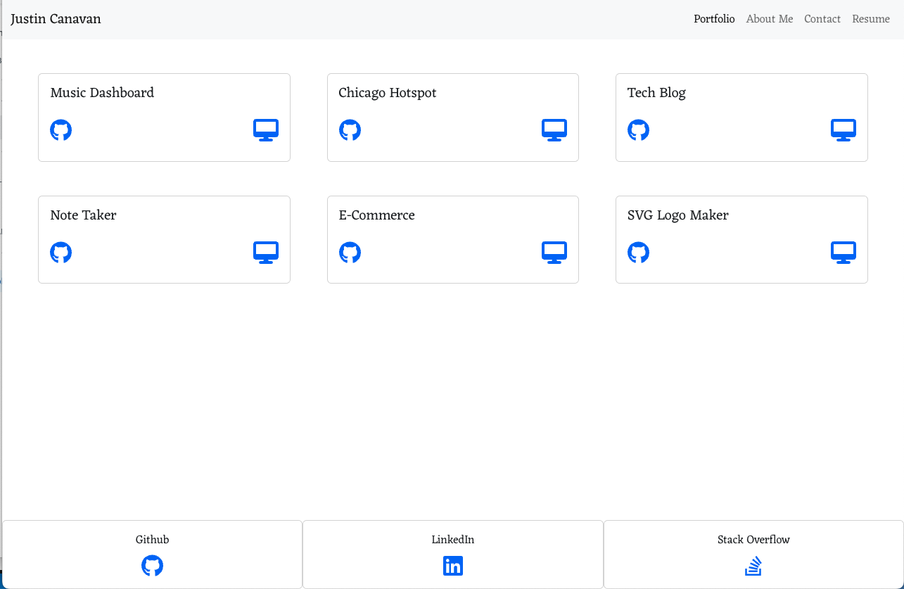
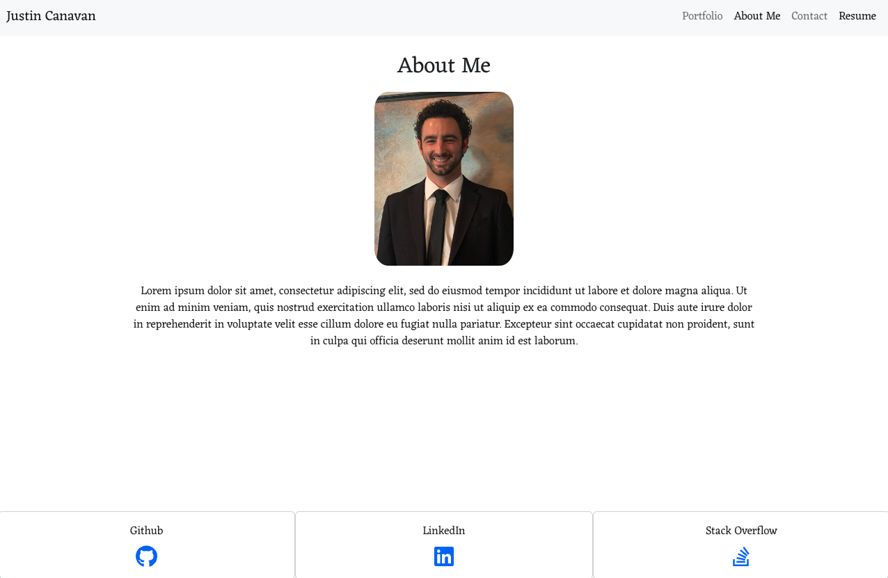

# react-portfolio

## Description 

I wanted to create a portfolio so that I could display my skill set to potential employers in a clean and organized fashion.

## Usage

View video demonstration below:

## Questions

Feel free to contact me with any questions!

## Email
justincanavanmusic@gmail.com

## Github Username
justincanavanmusic

### Resources
-bootcamp materials/instruction  
-guidance from tutor sessions, AskBCS, office hours/extra help from instructors  
